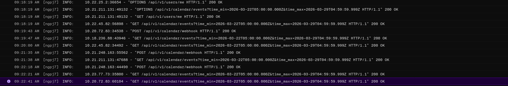
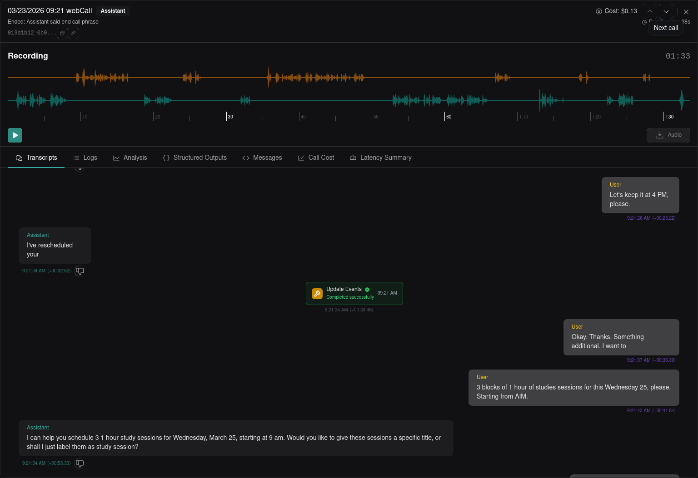

# Voice Scheduling Agent

A real-time AI voice assistant that naturally converses with users to schedule and manage Google Calendar events.

## Live Demo
- **Web App:** [[https://schedule-agent-client.onrender.com/](https://schedule-agent-client.onrender.com/)]
- **Demo Video:** [[https://www.loom.com/share/d44cc356a0e1481d8943bda6b31ccccf](https://www.loom.com/share/d44cc356a0e1481d8943bda6b31ccccf)]

## System Architecture

The project follows a decoupled architecture designed for low-latency voice interactions and high reliability:

* **Frontend**: Built with **React** and **Vite**, utilizing **Tailwind CSS** and **Shadcn UI** for a professional, responsive dashboard. It includes a custom **Weekly Calendar** component for real-time visualization.
* **Backend**: A **FastAPI** server handles authentication, session management, and the VAPI webhook.
* **Voice Orchestration**: **VAPI** manages the voice pipeline (STT, TTS, and LLM).
* **LLM**: **Gemini 2.5 Flash Lite** was selected for its high speed-to-cost ratio, ensuring near-instantaneous response times during conversation.
* **Integration**: **Google Calendar API** via **Google OAuth 2.0** for secure, user-specific data access.

## Key Features

### Assignment Requirements
* **Natural Conversation**: Riley, the AI assistant, initiates calls, greets the user, and manages the scheduling flow.
* **User Identification**: Automatically identifies the user via OAuth profile data or asks for a name if unavailable.
* **Smart Scheduling**: Collects date, time, and title, confirming all details before executing any calendar action.
* **Event Creation**: Seamlessly creates individual events directly in the user's Google Calendar.

### Extra Features
* **Batch Operations**: Unlike standard assistants, Riley can create, update, or delete multiple events in a single conversational turn using optimized batch tools (`schedule_events`, `update_events`, `delete_events`).
* **Real-time Delta Sync**: The frontend implements **Debounced Diffing**. When events change in the UI, a delta update is sent to the agent's memory to keep the context fresh without saturating the LLM.
* **Global Awareness**: Automatically detects the user's browser **timezone** (e.g., `America/Lima`, `Europe/London`) and passes it to the backend to ensure accurate scheduling worldwide.
* **Collision Detection**: Riley checks the existing schedule for conflicts before confirming a new meeting.

## Calendar Integration Logic

The agent interacts with Google Calendar through a secure, multi-step process:

1.  **OAuth Handshake**: Users authenticate with Google, and the backend securely stores encrypted refresh tokens.
2.  **Context Injection**: On call start, the backend fetches the current week's events and injects them into Riley's context as a list of IDs and summaries.
3.  **Tool Execution**: When an action is confirmed, VAPI sends a webhook to the FastAPI backend. The backend iterates through the requested changes and updates Google Calendar via the `google-api-python-client`.
4.  **UI Feedback**: The dashboard listens for tool success and performs a "background fetch" to update the calendar view without a page reload.

## Engineering Decisions

* **Batching for Latency**: By grouping multiple tasks into a single tool call, the agent avoids "talking too much" and reduces the number of round-trips to the Google API.
* **Context Management**: Implementing a **Debounce** on system updates prevents the agent from being overwhelmed by rapid UI changes, significantly reducing token consumption and costs.
* **State Consistency**: Riley uses the Google Event ID as the "Source of Truth," ensuring that edits and deletions are always applied to the correct record.

## Demo Logs

